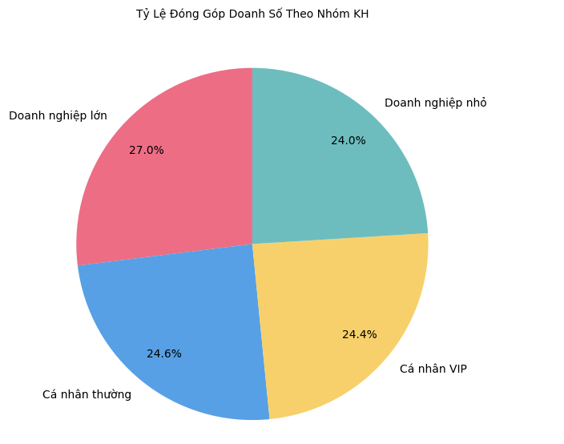
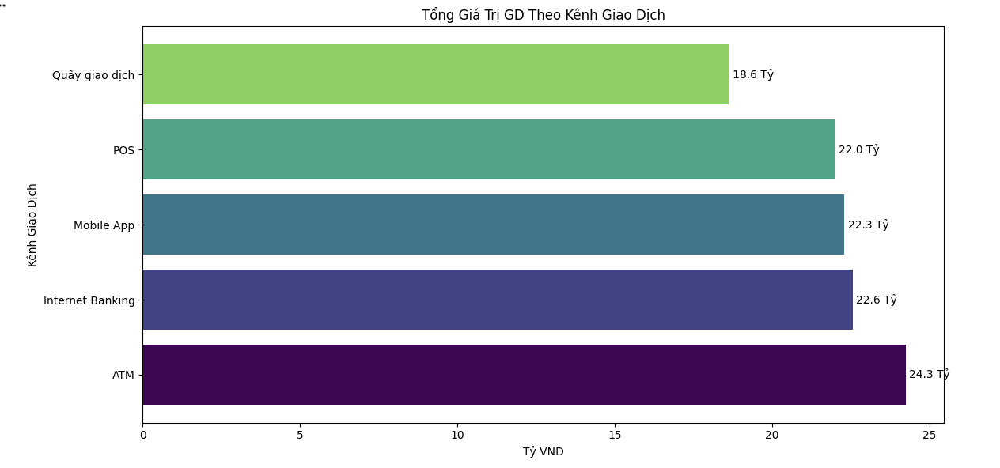
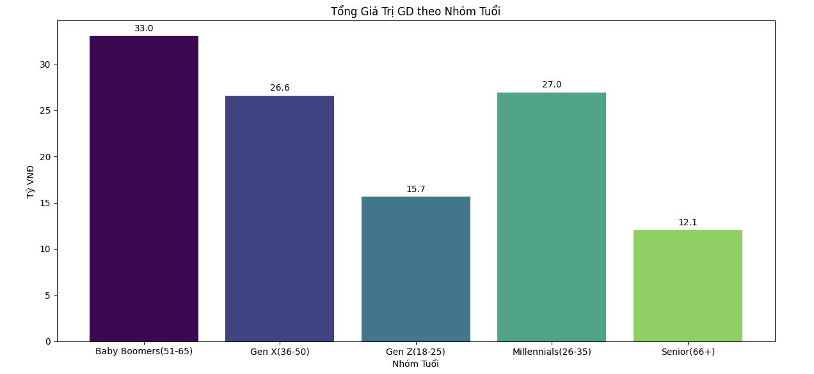
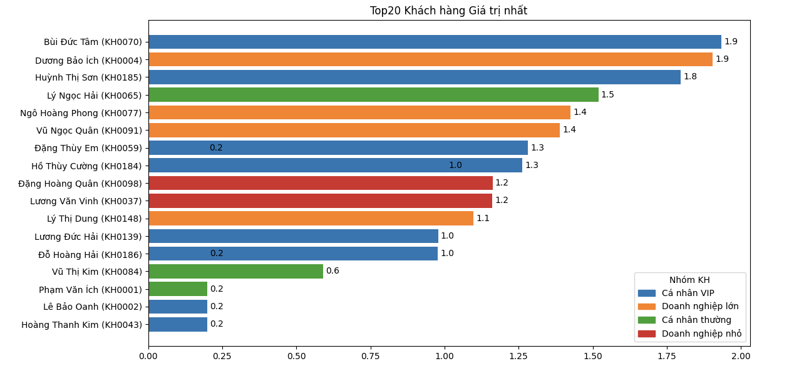

# 🏦 Customer & Banking Transaction Behaviour Analysis

## 📌 Project Overview

This project analyzes banking transaction data to understand customer behaviour across different customer segments, transaction channels, demographics, and time periods.

The objective is to translate transaction-level data into actionable insights that can support customer segmentation, channel strategy, and customer relationship management.

---

## 🎯 Business Questions

This analysis focuses on the following questions:

1. How do different customer groups — VIP, Individual, and Business — behave?
2. Which customer segments contribute the highest transaction value?
3. Which segments may require greater customer engagement?
4. Which transaction channels are most frequently used by each customer group?
5. Has the Mobile App become a major transaction channel?
6. How does transaction behaviour differ by age and gender?
7. How does transaction volume vary across different times of the day?
8. Who are the Top 20 customers by transaction value?

---

## 🛠️ Tools Used

- Python
- Pandas
- NumPy
- Matplotlib
- Jupyter Notebook
- Data Visualization

---

## 🔍 Analysis Process

### 1. Data Understanding

Reviewed the dataset structure, variable types, and customer transaction information.

### 2. Data Cleaning

- Checked missing values
- Removed duplicates
- Standardized categorical variables
- Converted transaction-related variables into appropriate data types

### 3. Exploratory Data Analysis

Analyzed:

- Customer segments
- Transaction value
- Transaction frequency
- Transaction channels
- Customer demographics
- Transaction time
- High-value customers

### 4. Business Interpretation

Translated analytical findings into customer and channel-level business insights.

---

## 📊 Key Analysis

### Customer Segment Analysis

Examined transaction behaviour across:

- VIP Customers
- Individual Customers
- Business Customers

<p align="center">
  
</p>

----

### Transaction Channel Analysis

Compared customer usage across different transaction channels to understand channel preference and digital adoption.

<p align="center">
  
</p>

---

### Customer Demographic Analysis

Analyzed how transaction patterns vary across age groups and gender.

<p align="center">
  
</p>

---

### Top Customers

Identified the Top 20 customers based on total transaction value.

<p align="center">
  
</p>

---

## 💡 Key Insights

- Customer segments show different patterns in transaction frequency and value.
- High-value customers contribute disproportionately to overall transaction value.
- Channel preferences differ across customer groups.
- Digital transaction channels show different adoption levels depending on customer characteristics.
- Customer demographic and behavioural information can be combined to support more targeted customer strategies.

---

## 💼 Business Recommendations

Based on the analysis:

- Prioritize retention strategies for high-value customer segments.
- Develop differentiated engagement strategies for VIP, Individual, and Business customers.
- Encourage digital channel adoption among customer groups with lower Mobile App usage.
- Use transaction behaviour together with demographic information for customer segmentation.
- Monitor high-value customers to support personalized relationship management.

---

## 📂 Repository Structure

```text
.
├── README.md
├── banking_analysis.ipynb
├── dataset/
├── images/
└── presentation/
