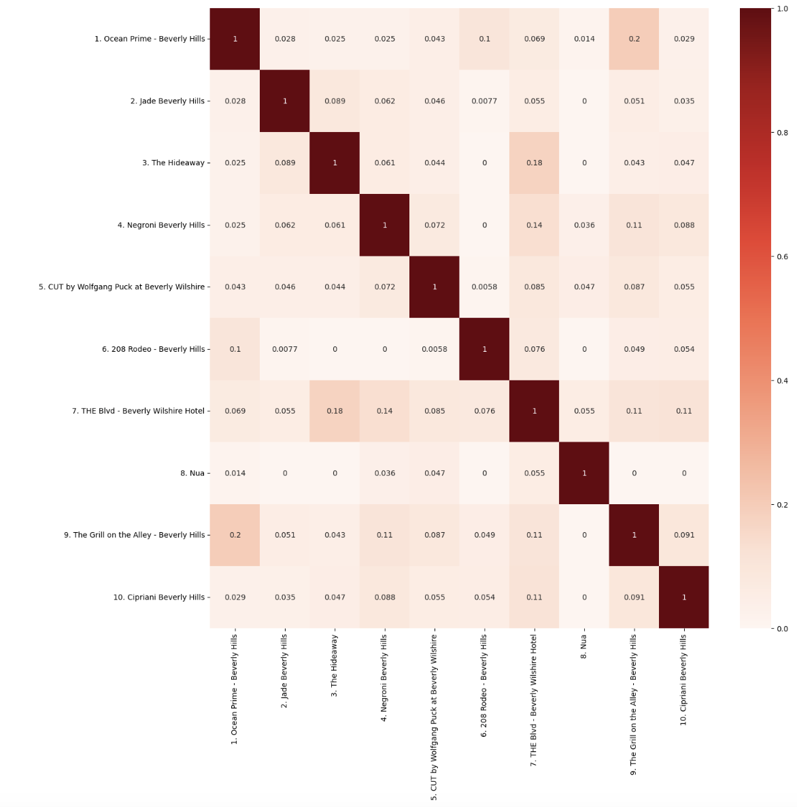

# 🍽️ Restaurant Market Entry & Competitive Positioning Analysis

## 📌 Project Overview

This project analyzes restaurant market positioning using textual restaurant information to identify similar competitors and potential differentiation opportunities.

The objective is to support **market entry and positioning decisions** by transforming restaurant descriptions into comparable text features and measuring concept similarity between restaurants.

---

## 🎯 Business Questions

This analysis focuses on the following questions:

1. Which restaurants have the most similar concepts and positioning?
2. Who are the closest competitors for a new restaurant concept?
3. Which restaurants are highly differentiated from the rest of the market?
4. Are there potential positioning gaps in the current competitive landscape?
5. How can text analytics support restaurant market entry decisions?

---

## 🛠️ Tools Used

- Python
- Pandas
- NumPy
- Scikit-learn
- TF-IDF
- Cosine Similarity
- Matplotlib / Seaborn
- Jupyter Notebook

---

## 🔍 Analysis Process

### 1. Business Context

Defined the market-entry problem and identified restaurant concept and positioning as key factors for competitor analysis.

### 2. Data Preparation

- Reviewed restaurant information
- Cleaned textual descriptions
- Standardized text format
- Removed unnecessary characters and noise
- Prepared restaurant descriptions for NLP analysis

### 3. Text Vectorization

Applied **TF-IDF (Term Frequency–Inverse Document Frequency)** to transform restaurant descriptions into numerical vectors representing important concept-related terms.

### 4. Similarity Analysis

Calculated **Cosine Similarity** between restaurant vectors to measure how similar restaurant concepts are to one another.

### 5. Competitive Positioning

Used the similarity results to identify:

- Closest competitors
- Highly similar restaurant concepts
- More differentiated concepts
- Potential areas for market positioning

---

## 📊 Key Analysis

### Competitive Positioning Heatmap

The similarity matrix was visualized as a heatmap to make competitive relationships easier to identify.

<p align="center">
  
</p>


## 💡 Key Insights

- Some restaurants show strong similarity in their concept and positioning, suggesting direct competitive overlap.
- Other restaurants occupy more differentiated positions within the market.
- Text-based similarity analysis provides a structured way to identify competitors beyond simple category labels.
- Highly crowded positioning areas may require stronger differentiation for a new market entrant.
- Less-saturated concept areas may represent potential opportunities, although additional market validation would be required.

---

## 💼 Business Recommendations

Based on the analysis:

- Avoid entering the market with a concept that strongly overlaps with multiple existing competitors.
- Identify specific attributes that can differentiate the new restaurant from its closest competitors.
- Use competitor similarity together with pricing, location, customer reviews, and demand data before making final market-entry decisions.
- Focus positioning strategy on areas where competitive overlap is relatively lower.
- Continuously monitor competitor descriptions and customer perceptions as restaurant positioning evolves.

---

## 📂 Repository Structure

```text
.
├── README.md
├── restaurant_positioning_analysis.ipynb
├── dataset/
├── images/
└── presentation/
