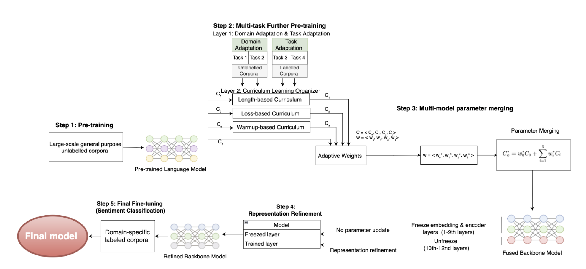

# Vietnamese Financial Sentiment Classification with PhoBERT

## 📌 Project Overview

This project develops a **multi-stage domain-adaptive fine-tuning framework** to improve Vietnamese financial sentiment classification using Pre-trained Language Models (PLMs).

The study focuses on adapting **PhoBERT**, a Vietnamese monolingual language model originally pre-trained on general-domain text, to the specialized language and sentiment patterns found in Vietnamese financial news.

The final task classifies financial news into three sentiment categories:

- 🟢 Positive
- ⚪ Neutral
- 🔴 Negative

The proposed framework combines **domain adaptation, task adaptation, curriculum learning, model parameter merging, and supervised contrastive learning** before final sentiment classification.

> 🎓 This project was developed as my Master's thesis in Information Systems at Korea University Business School.

---
## 🎯 Research Problem

General-purpose Pre-trained Language Models may struggle with financial text because financial language contains:

- Domain-specific terminology
- Implicit sentiment expressions
- Context-dependent meanings
- Ambiguous neutral sentiment

In Vietnamese NLP, this challenge is further complicated by limited domain-specific resources and the linguistic characteristics of Vietnamese.

This project therefore investigates:

1. Can a multi-stage adaptation framework improve Vietnamese financial sentiment classification compared with standard fine-tuning?
2. Can the proposed framework generalize beyond PhoBERT to other Vietnamese and multilingual PLMs?

---

## 🛠️ Tools & Technologies

- Python
- PyTorch
- Hugging Face Transformers
- PhoBERT
- ViBERT
- DistilBERT
- VNCoreNLP / RDRSegmenter
- Scikit-learn
- Pandas
- NumPy
- Google Colab
- CUDA

### Core NLP Techniques

`Transformer Models` `Masked Language Modeling` `Domain Adaptation`  
`Task Adaptation` `Curriculum Learning` `Parameter Merging`  
`Supervised Contrastive Learning` `Sentiment Classification`

---

## 📊 Dataset

The framework combines both **unlabelled and labelled Vietnamese textual datasets** for domain adaptation, task adaptation, parameter merging, and final classification.

| Stage | Data | Learning Type | Samples |
|---|---|---|---:|
| Domain Adaptation | Financial news summaries | Unlabelled | 1,397 |
| Domain Adaptation | Financial news titles | Unlabelled | 2,000 |
| Task Adaptation | General news titles | 50 topic labels | 1,944 |
| Task Adaptation | General comments | 3 sentiment labels | 2,000 |
| Model Merging | Financial news summaries | Unlabelled | 1,180 |
| Final Fine-tuning | Financial news titles | 3 sentiment labels | 1,005 |

**Total samples across datasets: 9,526**

The final financial sentiment dataset contains three labels:

`Positive` · `Neutral` · `Negative`

---

## 🧠 Proposed Framework

<p align="center">
  
</p>

The proposed framework extends the conventional **Pre-training → Fine-tuning** pipeline by introducing three intermediate adaptation stages.

### Step 1 — PLM Initialization

The framework starts from the pre-trained **PhoBERT-base** model.

PhoBERT serves as the general Vietnamese language backbone before financial-domain adaptation.

---

### Step 2 — Multi-task Domain & Task Adaptation

The model is further adapted through four tasks.

#### Domain Adaptation

**Task 1 — Financial News Summaries**

Masked Language Modeling on unlabelled financial news summaries helps the model learn financial vocabulary, contextual patterns, and domain-specific semantics.

**Task 2 — Financial News Titles**

Masked Language Modeling on financial headlines helps the model adapt to shorter and more condensed financial language.

#### Task Adaptation

**Task 3 — Topic Classification**

General Vietnamese news titles with **50 topic labels** are used to strengthen structured semantic representations.

**Task 4 — Sentiment Classification**

General Vietnamese comments with **Positive, Neutral, and Negative** labels provide explicit sentiment supervision.

---

## 📚 Curriculum Learning

Instead of following only one adaptation sequence, three curriculum strategies are explored:

### 1. Length-based Curriculum

Tasks are ordered according to average tokenized sequence length.

### 2. Model-loss-based Curriculum

Task difficulty is determined according to the initial loss produced by the model.

### 3. Warmup-based Curriculum

A fixed task sequence is combined with learning-rate warmup to provide more stable adaptation.

Each curriculum path produces a different adapted model checkpoint.

---

## 🔀 Step 3 — Multi-model Parameter Merging

Rather than selecting only one curriculum checkpoint, the framework combines multiple checkpoints:

```text
C0 = Original PhoBERT
C1 = Length-based Curriculum
C2 = Model-loss-based Curriculum
C3 = Warmup-based Curriculum
```

The merged model is calculated using a weighted combination:

```text
C* = w0C0 + w1C1 + w2C2 + w3C3
```

subject to:

```text
wi ≥ 0
Σwi = 1
```

A **Local Search with Decreasing Step Size (LSDS)** algorithm searches for the checkpoint weights that minimize validation **Masked Language Modeling loss**.

The search follows a coarse-to-fine sequence:

```text
0.50 → 0.10 → 0.05 → 0.01
```

This allows the framework to integrate complementary knowledge learned from different adaptation paths into one unified model.

---

## 🎯 Step 4 — Representation Refinement

After parameter merging, **Supervised Contrastive Learning (SCL)** is applied to improve the structure of the sentiment representation space.

The objective is to:

```text
Same sentiment class
        ↓
Move representations closer together

Different sentiment classes
        ↓
Push representations farther apart
```

This stage is particularly important for **Neutral sentiment**, where financial texts may share semantic characteristics with both positive and negative classes.

---

## 🏁 Step 5 — Final Fine-tuning

The refined backbone is finally fine-tuned on **1,005 labelled Vietnamese financial news titles** for three-class sentiment classification.

The financial dataset is split into:

```text
Training    70%
Validation  15%
Test        15%
```

The test set remains untouched until final evaluation.

---

# 📈 Results

## Overall Performance

| Model | Accuracy | Macro F1 | F1 Positive | F1 Neutral | F1 Negative |
|---|---:|---:|---:|---:|---:|
| LSTM | 0.7483 | 0.7049 | 0.6222 | 0.6835 | 0.8090 |
| CNN | 0.7947 | 0.7330 | 0.6190 | 0.7105 | 0.8696 |
| Random Forest | 0.7815 | 0.7258 | 0.6522 | 0.6667 | 0.8587 |
| Logistic Regression | 0.7748 | 0.7260 | 0.6154 | 0.7089 | 0.8538 |
| Naive Bayes | 0.7947 | 0.7404 | 0.6522 | 0.7042 | 0.8649 |
| Standard PhoBERT Fine-tuning | 0.8543 | 0.8168 | 0.7931 | 0.7324 | 0.9249 |
| **Proposed Framework** | **0.9006** | **0.8756** | **0.8620** | **0.8169** | **0.9479** |

---

## 🚀 Performance Improvement

Compared with standard PhoBERT fine-tuning:

```text
Accuracy
0.8543 → 0.9006
+4.63 percentage points

Macro F1
0.8168 → 0.8756
+5.88 percentage points
```

The largest class-level improvement occurs for **Neutral sentiment**:

```text
Neutral F1
0.7324 → 0.8169
+8.45 percentage points
```

This result is particularly important because neutral financial language can be difficult to distinguish from positive and negative sentiment.


# 🔬 Component Analysis

## Curriculum Learning

The effectiveness of curriculum learning depends on how task difficulty is defined.

| Strategy | Macro F1 |
|---|---:|
| Standard PhoBERT | 0.8168 |
| Length-based Curriculum | 0.7968 |
| Model-loss-based Curriculum | 0.8345 |
| **Warmup-based Curriculum** | **0.8522** |

The **warmup-based curriculum** achieved the strongest individual curriculum performance.

---

## Parameter Merging

| Approach | Accuracy | Macro F1 |
|---|---:|---:|
| Standard PhoBERT | 0.8543 | 0.8168 |
| Best Individual Curriculum Checkpoint | 0.8741 | 0.8522 |
| F1-based LSDS Merging | 0.8741 | 0.8457 |
| **MLM-based LSDS Merging** | **0.8940** | **0.8635** |

The results show that combining checkpoints through **MLM-loss-based parameter merging** performs better than simply selecting the strongest individual curriculum checkpoint.

---

## Supervised Contrastive Learning

Adding representation refinement further improves performance:

```text
Without Representation Refinement
Accuracy : 0.8940
Macro F1 : 0.8635
Neutral F1: 0.8000

With Representation Refinement
Accuracy : 0.9006
Macro F1 : 0.8756
Neutral F1: 0.8169
```

This suggests that Supervised Contrastive Learning improves class discrimination after model merging.

---

# 🌐 Generalization Across PLMs

The proposed framework was also evaluated with other backbone models.

### ViBERT

```text
Standard Fine-tuning
Accuracy : 0.6887
Macro F1 : 0.4940

Proposed Framework
Accuracy : 0.8410
Macro F1 : 0.8090
```

### Multilingual DistilBERT

```text
Standard Fine-tuning
Macro F1 : 0.7488

Proposed Framework
Macro F1 : 0.7665
```

The results indicate that the framework is not limited to PhoBERT and can also improve class-balanced performance across different PLM architectures.

---

## 💡 Key Findings

- Standard fine-tuning alone does not fully address the mismatch between general Vietnamese text and financial language.
- Domain and task adaptation can improve the quality of domain-specific representations.
- Curriculum-learning effectiveness depends strongly on the selected difficulty strategy.
- Parameter merging can preserve complementary knowledge learned through different adaptation paths.
- Supervised Contrastive Learning further improves sentiment-class discrimination.
- The strongest improvement is observed for the difficult **Neutral** sentiment class.
- The framework also shows applicability beyond PhoBERT.

---

## 💼 Practical Applications

Vietnamese financial sentiment classification can support:

- Automated analysis of large volumes of financial news
- Financial news monitoring
- Market sentiment tracking
- Decision-support systems for financial institutions
- Sentiment-based financial analytics
- Development of downstream market-monitoring and trading models

Rather than replacing financial decision-making, the model can serve as an analytical component for extracting structured sentiment signals from large-scale financial text.

---

## 📂 Repository Structure

```text
.
├── README.md
├── notebooks/
│   ├── step2_multitask_adaptation.ipynb
│   ├── step3_parameter_merging.ipynb
│   ├── step4_contrastive_learning.ipynb
│   └── step5_final_finetuning.ipynb
│
├── images/
│   ├── framework.png
│   ├── performance_comparison.png
│   ├── curriculum_comparison.png
│   └── generalization_results.png
│
├── results/
│   └── model_results.csv
│
└── thesis/
    └── masters_thesis.pdf
```

---

## ⚠️ Notes

Due to data licensing, source restrictions, and model file size, some datasets and trained checkpoints may not be publicly included in this repository.

The repository focuses on presenting the **methodology, experimental workflow, analysis, and reproducible implementation** of the research.
