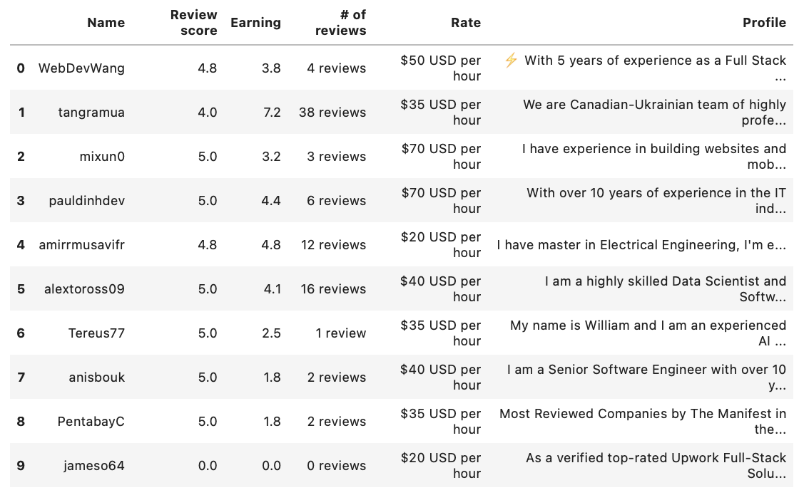

# Canadian Freelancer Market Analysis

## 📌 Project Overview

This project builds a web scraping workflow to collect publicly available freelancer information and explore characteristics of the Canadian freelance market.

The objective is to demonstrate how web data can be transformed into a structured dataset for market and competitor analysis.
---

## 🎯 Analysis Objectives

This project explores:

1. How freelancer profile information can be systematically collected from the web
2. What characteristics differentiate freelancer profiles
3. How hourly rates vary across freelancer profiles
4. Whether ratings, reviews, earnings, and pricing show observable patterns
5. How scraped market data can support freelance market research

---

## 🛠️ Tools Used

- Python
- Requests
- BeautifulSoup
- Pandas
- NumPy
- Matplotlib
- Jupyter Notebook

---

## 🔍 Data Collection Process

### 1. Web Scraping

Developed a Python-based scraping workflow to collect freelancer profile information from online pages.

### 2. Data Extraction

Collected available profile attributes such as:

- Freelancer profile information
- Rating
- Number of reviews
- Hourly rate
- Earnings
- Professional description

### 3. Data Cleaning

Processed the scraped data by:

- Removing unnecessary characters
- Converting numerical fields
- Handling missing values
- Standardizing profile information

### 4. Exploratory Analysis

Explored patterns across freelancer pricing and profile characteristics.

---

## 📊 Key Analysis

### Freelancer Market Overview

Summarized the characteristics of the collected freelancer profiles.

<p align="center">
  
</p>

---

## 💡 Key Insights

- Web scraping enables unstructured web information to be converted into structured market data.
- Freelancer profiles differ across pricing, ratings, reviews, and experience-related indicators.
- Hourly rate alone does not fully represent freelancer market positioning.
- Combining multiple profile indicators provides better context for competitor and market analysis.

---

## 💼 Business Application

The collected data can support:

- Freelancer market research
- Competitor benchmarking
- Pricing analysis
- Talent sourcing research
- Identification of market patterns for further analysis

---

## 📂 Repository Structure

```text
.
├── README.md
├── canadian_freelancer_scraping.ipynb
├── dataset/
├── images/
└── presentation/
